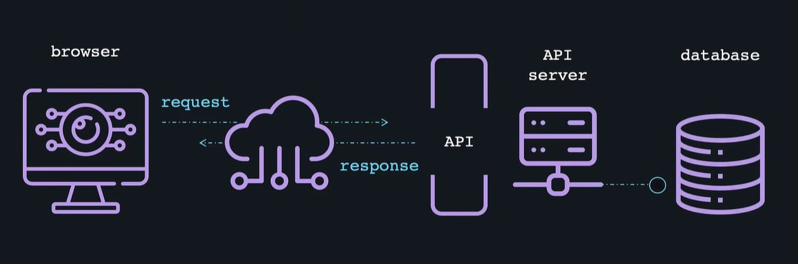

# API Development

## Web server and API

### Web server

- The primary role of a web server is to serve web pages for a website.
- If you want to host your web application on the internet, in many cases you will need a web server.
- A web page can be rendered from a single HTML file, or complex assortment of resources fitted together. (such as JS, scripts, CSS files etc.)

### Request response model

- The client sends a request for some data
- and the server responds to the request

### use-cases for a web server

- Serves HTML, CSS and JS files
- Serves images and videos
- Handles HTTP error messaging
- Handles user requests, often concurrently.
- Directs URL matching and rewriting
- Processes and serves dynamic content.

### API

- `Application programming interface`, which is set of definitions and protocols
  for building and integrating application software.
- APIs let your product or service communicate with other products and services without
  having to know how they're implemented



### Go docs

#### Http

```go
$ go doc http
package http // import "net/http"

Package http provides HTTP client and server implementations.

Get, Head, Post, and PostForm make HTTP (or HTTPS) requests:

    resp, err := http.Get("http://example.com/")
    ...
    resp, err := http.Post("http://example.com/upload", "image/jpeg", &buf)
    ...
    resp, err := http.PostForm("http://example.com/form",
        url.Values{"key": {"Value"}, "id": {"123"}})

The client must close the response body when finished with it:

    resp, err := http.Get("http://example.com/")
    if err != nil {
        // handle error
    }
    defer resp.Body.Close()
    body, err := io.ReadAll(resp.Body)
    // ...

For control over HTTP client headers, redirect policy, and other settings,
create a Client:

    client := &http.Client{
        CheckRedirect: redirectPolicyFunc,
    }

    resp, err := client.Get("http://example.com")
    // ...

    req, err := http.NewRequest("GET", "http://example.com", nil)
    // ...
    req.Header.Add("If-None-Match", `W/"wyzzy"`)
    resp, err := client.Do(req)
    // ...

For control over proxies, TLS configuration, keep-alives, compression, and
other settings, create a Transport:

    tr := &http.Transport{
        MaxIdleConns:       10,
        IdleConnTimeout:    30 * time.Second,
        DisableCompression: true,
    }
    client := &http.Client{Transport: tr}
    resp, err := client.Get("https://example.com")

Clients and Transports are safe for concurrent use by multiple goroutines
and for efficiency should only be created once and re-used.

ListenAndServe starts an HTTP server with a given address and handler. The
handler is usually nil, which means to use DefaultServeMux. Handle and
HandleFunc add handlers to DefaultServeMux:

    http.Handle("/foo", fooHandler)

    http.HandleFunc("/bar", func(w http.ResponseWriter, r *http.Request) {
        fmt.Fprintf(w, "Hello, %q", html.EscapeString(r.URL.Path))
    })

    log.Fatal(http.ListenAndServe(":8080", nil))

More control over the server''s behavior is available by creating a custom
Server:

    s := &http.Server{
        Addr:           ":8080",
        Handler:        myHandler,
        ReadTimeout:    10 * time.Second,
        WriteTimeout:   10 * time.Second,
        MaxHeaderBytes: 1 << 20,
    }
    log.Fatal(s.ListenAndServe())

Starting with Go 1.6, the http package has transparent support for the
HTTP/2 protocol when using HTTPS. Programs that must disable HTTP/2 can do
so by setting Transport.TLSNextProto (for clients) or Server.TLSNextProto
(for servers) to a non-nil, empty map. Alternatively, the following GODEBUG
environment variables are currently supported:

    GODEBUG=http2client=0  # disable HTTP/2 client support
    GODEBUG=http2server=0  # disable HTTP/2 server support
    GODEBUG=http2debug=1   # enable verbose HTTP/2 debug logs
    GODEBUG=http2debug=2   # ... even more verbose, with frame dumps

The GODEBUG variables are not covered by Go''s API compatibility promise.
Please report any issues before disabling HTTP/2 support:
https://golang.org/s/http2bug

The http package Transport and Server both automatically enable HTTP/2
support for simple configurations. To enable HTTP/2 for more complex
configurations, to use lower-level HTTP/2 features, or to use a newer
version of Go http2 package, import "golang.org/x/net/http2" directly and
use its ConfigureTransport and/or ConfigureServer functions. Manually
configuring HTTP/2 via the golang.org/x/net/http2 package takes precedence
over the net/http package''s built-in HTTP/2 support.

const MethodGet = "GET" ...
const StatusContinue = 100 ...
const DefaultMaxHeaderBytes = 1 << 20
const DefaultMaxIdleConnsPerHost = 2
const TimeFormat = "Mon, 02 Jan 2006 15:04:05 GMT"
const TrailerPrefix = "Trailer:"
var ErrNotSupported = &ProtocolError{ ... } ...
var ErrBodyNotAllowed = errors.New("http: request method or response status code does not allow body") ...
var ServerContextKey = &contextKey{ ... } ...
var DefaultClient = &Client{}
var DefaultServeMux = &defaultServeMux
var ErrAbortHandler = errors.New("net/http: abort Handler")
var ErrBodyReadAfterClose = errors.New("http: invalid Read on closed Body")
var ErrHandlerTimeout = errors.New("http: Handler timeout")
var ErrLineTooLong = internal.ErrLineTooLong
var ErrMissingFile = errors.New("http: no such file")
var ErrNoCookie = errors.New("http: named cookie not present")
var ErrNoLocation = errors.New("http: no Location header in response")
var ErrServerClosed = errors.New("http: Server closed")
var ErrSkipAltProtocol = errors.New("net/http: skip alternate protocol")
var ErrUseLastResponse = errors.New("net/http: use last response")
var NoBody = noBody{}
func CanonicalHeaderKey(s string) string
func DetectContentType(data []byte) string
func Error(w ResponseWriter, error string, code int)
func Get(url string) (resp *Response, err error)
func Handle(pattern string, handler Handler)
func HandleFunc(pattern string, handler func(ResponseWriter, *Request))
func Head(url string) (resp *Response, err error)
func ListenAndServe(addr string, handler Handler) error
func ListenAndServeTLS(addr, certFile, keyFile string, handler Handler) error
func MaxBytesReader(w ResponseWriter, r io.ReadCloser, n int64) io.ReadCloser
func NewRequest(method, url string, body io.Reader) (*Request, error)
func NewRequestWithContext(ctx context.Context, method, url string, body io.Reader) (*Request, error)
func NotFound(w ResponseWriter, r *Request)
func ParseHTTPVersion(vers string) (major, minor int, ok bool)
func ParseTime(text string) (t time.Time, err error)
func Post(url, contentType string, body io.Reader) (resp *Response, err error)
func PostForm(url string, data url.Values) (resp *Response, err error)
func ProxyFromEnvironment(req *Request) (*url.URL, error)
func ProxyURL(fixedURL *url.URL) func(*Request) (*url.URL, error)
func ReadRequest(b *bufio.Reader) (*Request, error)
func ReadResponse(r *bufio.Reader, req *Request) (*Response, error)
func Redirect(w ResponseWriter, r *Request, url string, code int)
func Serve(l net.Listener, handler Handler) error
func ServeContent(w ResponseWriter, req *Request, name string, modtime time.Time, ...)
func ServeFile(w ResponseWriter, r *Request, name string)
func ServeTLS(l net.Listener, handler Handler, certFile, keyFile string) error
func SetCookie(w ResponseWriter, cookie *Cookie)
func StatusText(code int) string
type Client struct{ ... }
type CloseNotifier interface{ ... }
type ConnState int
    const StateNew ConnState = iota ...
type Cookie struct{ ... }
type CookieJar interface{ ... }
type Dir string
type File interface{ ... }
type FileSystem interface{ ... }
    func FS(fsys fs.FS) FileSystem
type Flusher interface{ ... }
type Handler interface{ ... }
    func FileServer(root FileSystem) Handler
    func NotFoundHandler() Handler
    func RedirectHandler(url string, code int) Handler
    func StripPrefix(prefix string, h Handler) Handler
    func TimeoutHandler(h Handler, dt time.Duration, msg string) Handler
type HandlerFunc func(ResponseWriter, *Request)
type Header map[string][]string
type Hijacker interface{ ... }
type ProtocolError struct{ ... }
type PushOptions struct{ ... }
type Pusher interface{ ... }
type Request struct{ ... }
type Response struct{ ... }
type ResponseWriter interface{ ... }
type RoundTripper interface{ ... }
    var DefaultTransport RoundTripper = &Transport{ ... }
    func NewFileTransport(fs FileSystem) RoundTripper
type SameSite int
    const SameSiteDefaultMode SameSite = iota + 1 ...
type ServeMux struct{ ... }
    func NewServeMux() *ServeMux
type Server struct{ ... }
type Transport struct{ ... }
```

#### Listen and serve method

```go
$ go doc http ListenAndServe
package http // import "net/http"

func ListenAndServe(addr string, handler Handler) error
    ListenAndServe listens on the TCP network address addr and then calls Serve
    with handler to handle requests on incoming connections. Accepted
    connections are configured to enable TCP keep-alives.

    The handler is typically nil, in which case the DefaultServeMux is used.

    ListenAndServe always returns a non-nil error.
```

#### Default Serve Mux

```go
$ go doc http DefaultServeMux
package http // import "net/http"

var DefaultServeMux = &defaultServeMux
    DefaultServeMux is the default ServeMux used by Serve.
```

```go
$ go doc http servemux
package http // import "net/http"

type ServeMux struct {
        // Has unexported fields.
}
    ServeMux is an HTTP request multiplexer. It matches the URL of each incoming
    request against a list of registered patterns and calls the handler for the
    pattern that most closely matches the URL.

    Patterns name fixed, rooted paths, like "/favicon.ico", or rooted subtrees,
    like "/images/" (note the trailing slash). Longer patterns take precedence
    over shorter ones, so that if there are handlers registered for both
    "/images/" and "/images/thumbnails/", the latter handler will be called for
    paths beginning "/images/thumbnails/" and the former will receive requests
    for any other paths in the "/images/" subtree.

    Note that since a pattern ending in a slash names a rooted subtree, the
    pattern "/" matches all paths not matched by other registered patterns, not
    just the URL with Path == "/".

    If a subtree has been registered and a request is received naming the
    subtree root without its trailing slash, ServeMux redirects that request to
    the subtree root (adding the trailing slash). This behavior can be
    overridden with a separate registration for the path without the trailing
    slash. For example, registering "/images/" causes ServeMux to redirect a
    request for "/images" to "/images/", unless "/images" has been registered
    separately.

    Patterns may optionally begin with a host name, restricting matches to URLs
    on that host only. Host-specific patterns take precedence over general
    patterns, so that a handler might register for the two patterns
    "/codesearch" and "codesearch.google.com/" without also taking over requests
    for "http://www.google.com/".

    ServeMux also takes care of sanitizing the URL request path and the Host
    header, stripping the port number and redirecting any request containing .
    or .. elements or repeated slashes to an equivalent, cleaner URL.

func NewServeMux() *ServeMux
func (mux *ServeMux) Handle(pattern string, handler Handler)
func (mux *ServeMux) HandleFunc(pattern string, handler func(ResponseWriter, *Request))
func (mux *ServeMux) Handler(r *Request) (h Handler, pattern string)
func (mux *ServeMux) ServeHTTP(w ResponseWriter, r *Request)
```

## HTTP Verbs

- Http defines a set of `request methods` to indicate the desired action to be performed
  for a giver resource.
- Although they can also be nouns, these request methods are sometimes referred to as `Http Verbs`.

### Get

- Get method requests a representation of the specified resource.
- Requests using GET should only retrieve data

### POST

- The `post` method submits an entity to the specified resource, often causing a change in state
  or side effects on the server.

### PUT

- The `PUT` method replaces all current representations of the target resource with the request payload.

### DELETE

- The DELETE method deletes the specified resource.

## REST Architecture

- REST stands for `Representational State Transfer`
- REST is a set of architectural constraints, not a protocol or a standard.
- When a client request is made via a RESTful API, it transfers a representation of the state of the
  resource to the requester or endpoint.
- This data is delivered in one of several formats via HTTP: JSON, HTML, XLT, Python, PHP, or plain text.
- JSON is the most generally popular file format to use.
- A client-server architecture made up of clients, servers, and resources, with requests managed through HTTP.
- Stateless client-server communication, meaning no client information is stored between get requests and each request is separate and unconnected.
- A uniform interface between components so that information is transferred in a standard form.
- `Code-on-demand` (optional): the ability to send executable code from the server to the client when requested, extending client functionality.

## gorilla/mux router

- Package gorilla/mux implements a request router and dispatch for matching incoming requests to their respective handler
- The name mux stands for "Http request multiplexer"
- Like the standard `http.ServeMux`
  - `mux.Router` matches incoming requests against a list of registered routes and calls a handler for the route
    that matches the URL or other conditions.

### Supports method-based routing

- Router makes it easy to dispatch a HTTP request to different handlers based on the request method such as
  - GET
  - POST
  - PUT
  - DELETE
  - PATCH

### Supports variables in URL Path

- url paths with variables (eg: /movies/{id})
- Regex route patterns
